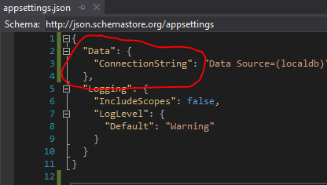
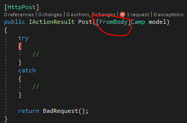

# Implementing and Securing an API with ASP.NET Core
Started the tutorial on 2017-09-16.

The MyCodeCamp.Data project found in GitHub is using .NET Core 1.0. I updated everything to use the new [.NET Core 2.0](https://blogs.msdn.microsoft.com/dotnet/2017/08/14/announcing-net-core-2-0/).
The Claims and Roles are not found after migrating the solution to .NET Core 2.0. I will work on that later in the course.

## Getting Started
See the [MyCodeCamp](MyCodeCamp) project.

## Reading Data

### First Controller
Avoid launching the browser

### The Data Model

The MyCodeCamp.Data project is found here: https://github.com/shawnwildermuth/WebAPICoreResources. (In the future that project should be a library. There's a comment on the Program.cs file).

The tutorial showed a CMD `dotnet ef database update` to create the database. I actually did it in the Package Manager Console `Update-Database`

### Getting Collections

Copy the connection string from the MyCodeCamp.Data project to MyCodeCamp

### Getting Items

Add `services.AddMvc().AddJsonOptions` to avoid circular serialization in EF Entities.

## Modifying Data via an API

### Designing URIs
Helpful URI design

### Demo: Model Binding
Use the `FromBody` tribute to accept a JSON payload. Without it, the properties are not generated.

SoapUI JSON request

### Demo: Logging

Very useful!

- Configure in Startup.cs
- Add the DI in the controller
- Enjoy!

## Entities and Models

### Demo: Customizing Mappings

AutoMapper.Extensions.Microsoft.DependencyInjection added. Very useful!

## Association in APIs

### Demo: Adding Validation

Using filters to avoid the `if (!ModelState.IsValid)` in every action

## Securing APIs

### Demo: Using Identity

Overriding the default behavior of Cookies Authentication.

### Demo: Cookie Authentication

I stopped using SoapUI and switched to Postman (desktop) to auto send the received cookie.

## Token Authentication

### Demo: Authorizing with Claims

No comments for this section since I was excited just doing the modules. Bonus: I added a TokenSettings configuration object

## Versioning your API

### Demo: Using Versioning Attributes

Using an optional parameter `api-version`, we could add versioning.

